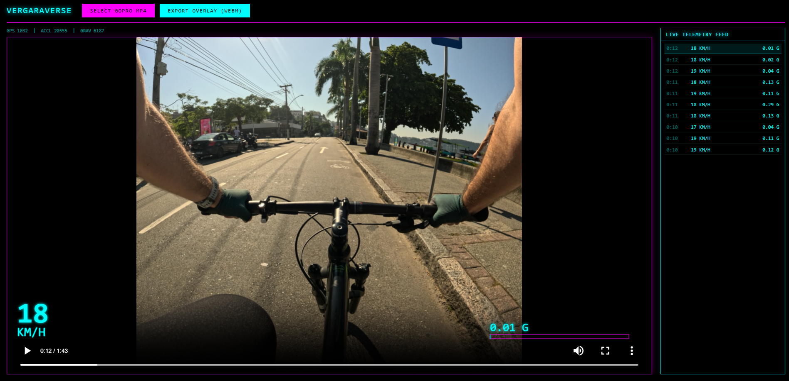
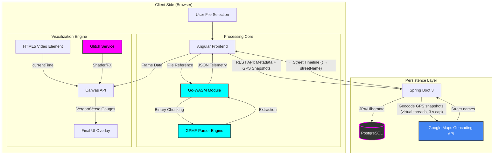

# VergaraVerse: Telemetry-Driven Content Engine

> A browser-native pipeline that parses GoPro GPMF telemetry directly from MP4 files using a zero-dependency WebAssembly module, renders 60 Hz speed and G-force overlays on a Canvas HUD, exports frame-accurate WebM clips, and catalogs ride history in a Spring Boot + PostgreSQL library — all without a server touching the raw video. Strava GPX files can be loaded as an alternative GPS source, with the route clipped to the video's exact timeframe and rendered on the same Canvas HUD.

<!-- Add dashboard screenshot here: full layout with video player + Live Telemetry Feed panel active -->


---

## The Problem

GoPro cameras embed a proprietary binary telemetry stream called **GPMF** (GoPro Metadata Format) inside a dedicated MP4 track. There is no browser API to read it. Every sample — GPS coordinates, 200 Hz accelerometer data, gravity vectors — is packed in a **KLV (Key-Length-Value)** binary format where 4-byte ASCII FourCC keys identify each field, a scale factor (`SCAL`) must be divided out before the values are physically meaningful, and every field is padded to a 4-byte boundary that must be tracked manually or the cursor silently desynchronises.

The standard approach is to ship the file to a server for processing. This project does it entirely in the browser.

---

## Architecture

Three independent subsystems, each with a hard boundary on what it owns.

### Pillar 1 — The GPMF Parser (Go → WebAssembly)

The core is a Go binary parser compiled to WASM via **TinyGo**. It receives a pre-extracted, pre-concatenated `Uint8Array` of the MP4 MET track from Angular — never the full video file — and walks every KLV field manually.

**Why TinyGo imposes unusual constraints.** TinyGo does not support Go's `encoding/binary.Read` with struct targets at full runtime scale because that path uses reflection. Every read in this parser uses explicit BigEndian helpers:

```go
key  := binary.BigEndian.Uint32(buf[pos:])
rep  := binary.BigEndian.Uint16(buf[pos+6:])
// binary.Read(r, binary.BigEndian, &myStruct) — forbidden
```

Equally critical: `json.Unmarshal` is blocked for the same reason. The result JSON is built by hand using string concatenation — ugly, but the only path that compiles to a working WASM binary.

**The 64 MB ceiling is hard, not aspirational.** The WASM module shares the browser's main-thread heap with the 4K video decoder. A 60-minute ride at 200 Hz ACCL produces ~720,000 samples × ~48 bytes ≈ 34 MB. Every slice is pre-allocated against a known upper bound; no `append` runs inside an unbounded STRM loop. Exceeding 64 MB OOM-kills the tab mid-export.

**Option B: the parser owns the unit conversion.** Every raw integer sensor value is divided by its `SCAL` factor inside the parser before the result JSON is emitted. Angular never sees raw counts. This boundary is enforced by a pre-merge audit — any sensor decode block that does not end with a SCAL divide is a merge blocker.

**Sensors in scope:**

| Sensor | FourCC | Role |
|---|---|---|
| GPS (Hero 11+) | `GPS9` | Primary — speed, route, timestamps |
| GPS (Hero 10 and older) | `GPS5` | Fallback when no GPS9 stream found |
| Accelerometer | `ACCL` | Slam Detector input (200 Hz) |
| Gravity vector | `GRAV` | Slam Detector input |

**WASM exports (the JS↔Go ABI):**

```
allocBuffer(size uint32) uint32       — returns pointer to input buffer in linear memory
parseGPMF(length, videoStartSec uint32) uint32  — ErrSuccess=0 or error code
getResultPtr() uint32
getResultLen() uint32
```

JS writes the MET binary into `allocBuffer`'s returned pointer, calls `parseGPMF`, then reads a JSON blob from `getResultPtr/Len`. The worker that hosts the WASM instance is **terminated immediately** after receiving the result, releasing the entire `WebAssembly.Memory` in one atomic step — the Nuke Option.

---

### Pillar 2 — The Canvas Overlay Engine (Angular + Canvas API)

The WASM result lands in Angular as a `TelemetryResult` object: three typed arrays (`GPS9Sample[]`, `ACCLSample[]`, `GRAVSample[]`) where every atom carries a `.t` value in **milliseconds from video start**, matching `HTMLVideoElement.currentTime × 1000` exactly. A unit mismatch at this boundary is silent at compile time but clips every overlay reading to the first or last atom in the array — a lesson from Sprint 1.

**The 60 Hz overlay** runs in `requestAnimationFrame`. For each frame, `TelemetryMathService` runs a lower-bound binary search to find the closest atom to `currentTime`, then linearly interpolates speed between the two nearest locked GPS samples. No allocations happen in the hot path.

**The WebM export** uses a *Ghost Canvas* — a regular `HTMLCanvasElement` created in the JS heap, never appended to the DOM. `captureStream(30)` extracts a `MediaStream`; `MediaRecorder` encodes to VP9/WebM at 5 Mbps. Frames are driven by `requestVideoFrameCallback()`, which fires exactly once per decoded video frame and re-arms itself unconditionally, keeping CPU idle between frames. The display canvas is unaffected — no black background on screen during export.

A key correctness detail: `requestVideoFrameCallback` stops firing a few frames before `videoEl.ended` becomes true. Polling `ended` inside the callback therefore never catches the termination and the recorder hangs. The fix decouples the stop trigger: a separate `{ once: true }` `'ended'` DOM listener calls `recorder.stop()` independently of the frame callback chain.

<!-- Add exported frame screenshots here: cyan speed readout bottom-left, G-force bar bottom-right -->


---

### Strava GPX Integration

When a GoPro clip is not the GPS source of truth — or when GPS lock was poor — a Strava `.gpx` file can be uploaded as a substitute. The toggle in the header switches between `GoPro` and `Strava` data sources; `drawVectorMap()` and the position dot consume whichever array is active.

**Load-order problem.** A GPX file is often uploaded *before* the GoPro MP4 is loaded. At that point `videoStartEpoch` is unknown (defaults to `0`), so naïve `.t = absoluteUnixMs - 0` makes all Strava timestamps ≈ 1.78 × 10¹² ms — dwarfing any `currentTime` value. The position dot is always stuck at the first point.

**Fix: store `absoluteUnixMs`, re-anchor later.** `StravaGpsPoint` carries the raw wall-clock millisecond from the GPX `<time>` element (`absoluteUnixMs = new Date(timeStr).getTime()`). After the GoPro video finishes parsing, `onFileSelected()` recomputes every Strava point's `.t`:

```typescript
const videoStartMs = result.videoStartEpoch * 1000;
this.stravaGps.update(pts => pts.map(p => ({
  ...p,
  t:               p.absoluteUnixMs - videoStartMs,
  relativeTimeSec: (p.absoluteUnixMs - videoStartMs) / 1000,
})));
```

`absoluteUnixMs` is written once from the GPX and never recomputed. Both load orders (GPX-first, video-first) converge to correct `.t` values.

**Temporal clip.** Strava activities are typically full rides (1–3 hours); GoPro clips are a few minutes. `drawVectorMap()` filters the array to points with `0 ≤ t ≤ videoDurationMs` before building any geometry. The map bounding box is computed from the clipped points, so the projection fills the map widget with only the in-video portion rather than compressing the relevant segment to a few pixels.

**Manual sync offset.** When a phone records video and Strava records GPS simultaneously but the device clocks are not synchronised, every biometric reading arrives at the wrong video timestamp. The SYNC panel in the header exposes NLE-style `‹` / `›` nudge buttons that increment `syncOffsetMs` by ±100 ms per click. The offset is applied exclusively at interpolation lookup time:

```typescript
const renderTimeMs = videoEl.currentTime * 1000 + syncOffsetMs();
interpolateBiometrics(stravaGps, renderTimeMs);
```

`StravaGpsPoint.t` values are **never mutated** by the offset — shifting the lookup argument keeps the raw anchor timestamps stable for export and re-anchoring. The panel auto-appears when a GPX file is loaded and pulses with a cyan animation for Android users who have no GoPro telemetry to cross-reference against.

**Path2D caching.** Building a path by iterating N points in every 60 Hz frame is O(N) per frame. `drawVectorMap()` builds a `Path2D` object once on cache miss and calls `ctx.stroke(path2D)` — one native call with no array iteration — in the hot path. The cache key `{ width, srcLen, srcT0, durationMs }` detects canvas resize, new data, re-anchored timestamps, and new video loads.

**Zoom slider.** A `1×`–`8×` ZOOM slider is exposed in the header alongside the BG ALPHA control. Zoom is implemented with a canvas transform, not a map library call:

```
ctx.translate(dotX, dotY)   → ctx.scale(zoom) → ctx.translate(-dotX, -dotY)
```

This pins the current position dot while the route scales around it. `ctx.clip()` to the map box rectangle prevents the zoomed path from bleeding into the speed bar or G-force bar.

---

### Pillar 3 — The Ride Library (Spring Boot 3 + PostgreSQL)

The persistence layer enforces a hard data boundary: **heavy arrays never leave the browser**.

| Storage | What lives there | Access |
|---|---|---|
| **IndexedDB Vault** | `GPS9[]`, `ACCL[]`, `GRAV[]` — the full 200 Hz arrays | Browser-local, keyed by `filename + fileSize` |
| **PostgreSQL Library** | `ClipMetadataDto` — max speed, total distance, start/end GPS, top-5 impact timestamps | REST API — `GET /api/clips`, `POST /api/clips` |

The write-through flow executes in strict order after every successful parse: WASM parse → Vault save (awaited) → Library POST (fire-and-forget). The Vault save must complete before the POST because a POST success with a failed Vault write would leave the Library pointing at a clip with no local arrays.

**Spring Boot implementation notes:**

- `ClipMetadata.highlights` maps to a native PostgreSQL `bigint[]` column via `@Column(columnDefinition = "bigint[]")`. Hibernate 6.4 (Spring Boot 3.3) maps `Long[]` natively — no join table, no JSON serialisation.
- The DTO mapper reads `sessionId` from an `insertable = false, updatable = false` FK mirror column rather than accessing the lazy `@ManyToOne` proxy, which would trigger a SELECT-per-clip N+1 in `findAll()` with `open-in-view: false`.
- The datasource is **Neon serverless PostgreSQL**. Hikari is configured conservatively (`maximum-pool-size: 5`, `minimum-idle: 1`) to avoid overwhelming the serverless proxy. Flyway is wired but disabled during early prototyping; `ddl-auto: update` is a temporary concession to schema churn — **not production-safe**.

---

## Data Flow

```
                      ┌─────────────────────────────────────┐
                      │ User selects GoPro MP4              │
                      └──────────────┬──────────────────────┘
                                     │
                                     ▼
                       Mp4DemuxerService (Angular)
                       Streams 1 MB chunks via mp4box.
                       Extracts only GPMD binary track (~1–5 MB).
                       Video/audio mdat bytes never materialised.
                                     │
                                     ▼
                       gpmf-parser.worker.ts + gpmf.wasm
                       Ephemeral Web Worker; TinyGo WASM runs
                       KLV walk + SCAL divide; worker is terminated.
                                     │
               ┌─────────────────────┴──────────────────────┐
               │                                            │
               ▼                                            ▼
  TelemetryVaultService               ClipApiService (fire-and-forget)
  GPS9[], ACCL[], GRAV[] → IndexedDB  ClipMetadataDto → Spring Boot
  (awaited — must complete first)                      → PostgreSQL (Neon)

                    ┌──────────────────────────────────────┐
                    │ User uploads Strava .gpx (optional)  │
                    └──────────────┬───────────────────────┘
                                   │
                                   ▼
                     StravaTelemetryService (DOMParser)
                     Extracts lat/lon/ele/<time> from each <trkpt>.
                     absoluteUnixMs = new Date(timeStr).getTime()
                     t = absoluteUnixMs − videoStartEpoch × 1000
                     If video not loaded yet: re-anchored in onFileSelected().

At playback (source = GoPro or Strava):
  requestAnimationFrame loop
    → renderTimeMs = currentTime × 1000 + syncOffsetMs  ← SYNC nudge applied here
    → binary search + interpolation → Canvas HUD (speed, G-force, map dot)
    → Path2D cache hit → ctx.stroke(path2D) [no array iteration]
    → ctx.translate/scale zoom transform (1×–8×)

At export:
  requestVideoFrameCallback
    → exportRenderMs = currentTime × 1000 + syncOffsetMs  ← same offset, frame-accurate
    → Ghost Canvas render → MediaRecorder → WebM
```

---

## Tech Stack

| Layer | Technology |
|---|---|
| Frontend framework | Angular 17 (standalone components, Signals) |
| Binary parsing | Go + TinyGo compiled to WebAssembly |
| Canvas rendering | Canvas 2D API, `requestAnimationFrame`, `requestVideoFrameCallback` |
| Video export | `MediaRecorder` API, VP9/WebM, Ghost Canvas |
| Local storage | IndexedDB (heavy telemetry arrays) |
| Backend | Spring Boot 3.3, Spring Data JPA |
| ORM | Hibernate 6.4 |
| Database | PostgreSQL via Neon serverless |
| API | REST — `HttpClient` (Angular) ↔ `@RestController` (Spring Boot) |
| Build tooling | Angular CLI, TinyGo, Maven 3 |
| Language | TypeScript 5, Go 1.21, Java 21 |

---

## Project Structure

```
vergaraverse-engine/
├── angular/
│   └── src/
│       ├── app/
│       │   ├── core/
│       │   │   ├── models/          # TelemetryResult, ClipMetadataDto, StravaGpsPoint interfaces
│       │   │   ├── services/        # Mp4Demuxer, GpmfParser, TelemetryMath,
│       │   │   │                    # ClipApiService, TelemetryVaultService,
│       │   │   │                    # StravaTelemetryService (GPX → StravaGpsPoint[])
│       │   │   ├── workers/         # gpmf-parser.worker.ts (WASM host)
│       │   │   └── components/
│       │   │       └── telemetry-overlay/  # Canvas HUD + WebM export
│       │   └── app.{ts,html,scss}   # Dashboard shell, Vault ↔ Feed panel swap
│       ├── assets/
│       │   ├── gpmf.wasm            # Compiled TinyGo binary
│       │   └── wasm_exec.js         # TinyGo runtime bootstrap
│       └── environments/
│           └── environment.ts       # apiBaseUrl → http://localhost:8080
│
├── api/
│   └── src/main/java/com/vergaraverse/api/
│       ├── domain/
│       │   ├── entity/              # ClipMetadata, RideSession
│       │   └── repository/          # JpaRepository interfaces
│       ├── service/                 # ClipMetadataService (upsert, findAll, lookup)
│       ├── web/
│       │   ├── controller/          # ClipMetadataController (3 endpoints)
│       │   └── dto/                 # ClipMetadataDto, CreateClipRequest, RideSessionDto
│       └── config/                  # WebConfig (CORS)
│
└── go/                              # TinyGo WASM source
    └── main.go                      # KLV walker, SCAL application, JSON builder
```

---

## Getting Started

### Prerequisites

- **Node.js 20+** and **Angular CLI** (`npm install -g @angular/cli`)
- **Java 21** and **Maven 3.9+**
- **TinyGo 0.31+** (only needed if you rebuild the WASM module)
- A **Neon PostgreSQL** database (free tier works — get the connection string from the Neon console)

---

### 1. Boot the API

```bash
cd api
```

Create a `.env` file (or export these as shell variables):

```env
NEON_DB_URL=jdbc:postgresql://<host>/<dbname>?sslmode=require
NEON_DB_USERNAME=<username>
NEON_DB_PASSWORD=<password>
```

Run the Spring Boot application. On first start, `ddl-auto: update` will create the schema automatically:

```bash
mvn spring-boot:run
```

The API listens on `http://localhost:8080`. Verify with:

```
GET http://localhost:8080/api/clips   →  [] (empty array on a fresh database)
```

---

### 2. Start the Angular App

```bash
cd angular
npm install
ng serve
```

Open `http://localhost:4200`. The **VERGARAVERSE VAULT** panel on the right will populate with any previously catalogued clips fetched from PostgreSQL.

Select a GoPro MP4 to trigger the full pipeline: MP4 demux → WASM parse → IndexedDB Vault write → PostgreSQL Library write-through. The right panel switches to the **Live Telemetry Feed** the moment parsing completes.

---

### 3. (Optional) Rebuild the WASM Module

If you modify the Go parser:

```bash
cd go
tinygo build -o ../angular/src/assets/gpmf.wasm -target wasm .
```

The `wasm_exec.js` runtime bootstrap in `angular/src/assets/` must match the TinyGo version used to compile the WASM binary.

---

## API Reference

| Method | Path | Description |
|---|---|---|
| `GET` | `/api/clips` | Returns all catalogued clips sorted by insert order |
| `GET` | `/api/clips/lookup?filename=&fileSize=` | `200` if clip exists (skip WASM), `404` if cache miss (run WASM) |
| `POST` | `/api/clips` | Upserts a clip summary; geocodes GPS snapshots via Google Maps API; returns `streetTimeline` |

All endpoints are CORS-enabled for `http://localhost:4200`.

---

## Engineering Notes

This project was built sprint-by-sprint with adversarial design reviews before each new subsystem. A few constraints that shaped the architecture in non-obvious ways:

**Stride alignment in GPMF.** After reading `size × repeat` bytes for any KLV field, the cursor must advance to the next **4-byte boundary** (`(dataLen + 3) &^ 3`) before reading the next KLV header. GPMF pads every field's data. Skipping this silently misaligns every subsequent read — the second `STRM` block's FourCC decodes as garbage, and the parser either fails loudly or silently produces numerically plausible but wrong output.

**The G-force unit trap.** The Sprint 1 G-force bar glitched because `calculateGForceMagnitude` correctly returned the m/s² deviation from 1 G, but the overlay threshold constants expected G units. The fix was a single `/ 9.80665` division. This is structurally identical to a timestamp unit mismatch — correct in isolation, silent and catastrophic at the consumer. Option B (parser applies SCAL, Angular receives physical units) is the enforcement mechanism that prevents this class of bug.

**Export race condition.** `requestVideoFrameCallback` stops firing a few frames before `videoEl.ended` becomes true. Any export loop that polls `ended` inside the frame callback will stall permanently at the end of the video. The fix decouples the stop trigger from the render loop entirely: a separate `{ once: true }` `'ended'` DOM listener calls `recorder.stop()` independently. The listener reference is stored and removed in the early-cancel path to prevent it firing on an already-stopped recorder.

## System Architecture Diagram


